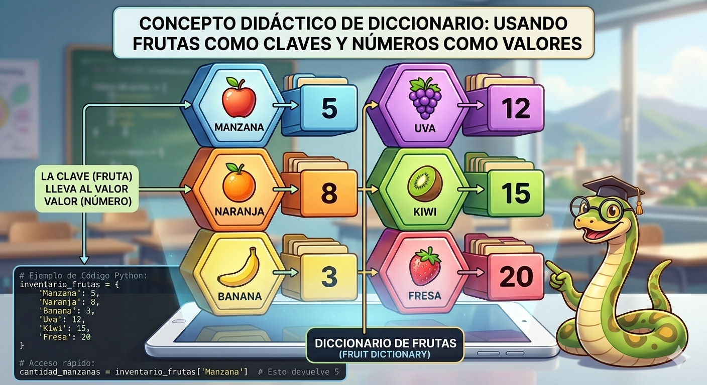

# diccionarios_python
conceptos y ejercicios de diccionarios en Python

- los diccionarios son datos estructurados, es decir, hacen referencia a una coleccion de datos.

- son una coleccion desordenada de pares de datos de la forma **clave:valor**, conocidos como elementos o items.

- son mutables, una vez definido se le pueden agregar nuevos elementos, modificar o eliminar algunos de los que ya tienen.

- tambien son conocidos como arreglos asociativos.

## Representacion grafica de un diccionario



## Sintaxis

`nombre_diccionario = {clave1:valor1, clave2:valor2,...}`

- cada item o elemento tiene la forma **clave:valor**.
-en cada item hay una clave y uno o mas valores. Si se desconoce el valor, sepuede completar con *None*.
- los elementos del diccionario se indexan por a clave.
- las claves solo pueden ser datos inmutables.
- los valores pueden ser datos mtables o inmutables.
- las claves no pueden repetirse dentro de un diccionario.

### Ejemplo

`inventario_frutas = {
    'Manzana': 5,
    'Naranja': 8,
    'Banana': 3,
    'Uva': 12,
    'Kiwi': 15,
    'Fresa': 20,
}`

## operaciones

### Agregar elementos

`nombre_diccionario[clave] = valor`

`inventario_frutas['cereza'] = 90`

### Consultar o modificar elementos

`print("el valor de pera es: ', inventario_frutas['pera'])`

### Eliminar elementos

`del inventario_frutas['pera']`

### Operador de pertenencia

```Python
if 'cereza' in inventario_frutas:
    print('Si esta cereza en el diccionario')
else:
    print('No esta cereza en el diccionario')
```

## Ejercicio
crea un programa en python que utiice un diccionario para guardar los nombres de sus amigos y su telefono, ensu caso, el diccionario representa una agenda teefonica, el progrma te pedira nombres y telefonos y los ira guardando en el diccionario (los nombres en mayusculas). Además, el programa debe permitir consultar o eliminar un telefono. incluya un menu de opciones.